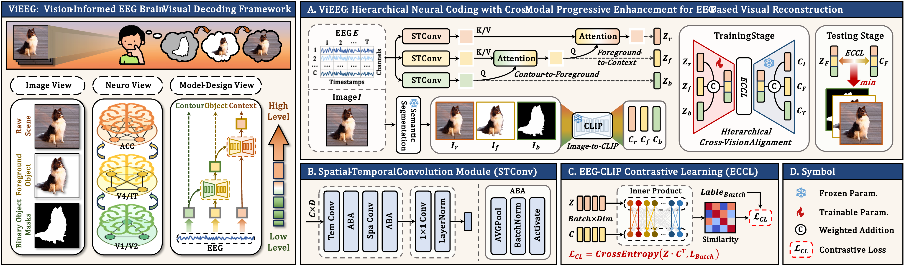

# 🧠✨ ViEEG: Hierarchical Visual Neural Representation for EEG Brain Decoding


*(International Conference on Machine Learning (ICML) / 2026)*

> Decoding visual information from brain signals is challenging — but also fascinating.  
> This project is a small step toward understanding how the brain perceives the visual world.

---

## 🚀 Overview

This repository contains the official implementation of **ViEEG**, a framework for **EEG-based visual decoding**.

**Core idea:**  
We aim to bridge **brain signals ↔ visual semantics** by modeling the **spatio-temporal dynamics of EEG** and aligning them with **rich visual representations**.

Unlike traditional approaches, our method focuses on:

- ⏳ Temporal evolution of neural responses  
- 🧠 Spatial interactions across brain regions  
- 🎯 Alignment with high-level visual semantics  

---

## 🌱 Motivation

EEG signals are:

- Noisy  
- Low in spatial resolution  
- Highly dynamic  

Yet, they contain **surprisingly rich information about perception**.

This project explores a simple question:

> *How much visual information can we recover from brain activity?*

---

## 🧩 Key Features

- ✨ EEG-based visual decoding framework  
- 🔗 Alignment with pretrained vision-language models (e.g., CLIP)  
- 🧠 Modeling temporal, spatial, and semantic aspects of EEG  
- 🧪 Potentially applicable to multiple electrophysiological signals:
  - EEG  
  - MEG  
  - ECoG / spike recordings (future exploration)

---

## 📂 Datasets

Many thanks to the community for providing high-quality datasets 🙏

- THINGS-EEG
- THINGS-MEG *(optional / future support)*  

---

## ⚙️ EEG Preprocessing

**Script path**

```bash
./datasets/THINGS-EEG/preprocessing_EEG/
```

**Data structure**

```
Raw EEG:
./Data/Things-EEG/Raw_data/

Processed EEG:
./Data/Things-EEG/Preprocessed_data_250Hz/
```

**Typical steps**

- Channel selection
- Epoching
- Baseline correction
- Resampling (e.g., 250 Hz)
- Condition sorting
- Normalization (z-score or multivariate normalization)

Run:

```
python preprocessing_EEG.py
```

------

## 🖼️ Image Features

We use pretrained models (e.g., CLIP, ViT, ResNet) to extract visual features.

**Script path**

```
./datasets/THINGS-EEG/preprocessing_CLIP/
```

**Data structure**

```
Images:
./Data/Things-EEG2/Image_set/

Feature maps:
./Data/Things-EEG2/EMBEDDINGS/
```

------

## 🏋️ Training & Testing

**Main script**

```
./main_config.py
```

Run:

```
python main.py
```

------

## 🤝 Collaboration

We genuinely believe this direction is still in its early stage.

If you are working on:

- Brain decoding
- EEG / MEG analysis
- Multimodal learning
- Neuroscience-inspired AI

👉 **We would love to collaborate.**

Feel free to:

- Open issues
- Start discussions
- Reach out directly

Even small ideas or questions are very welcome.

------

## 💬 Notes

- This repository is under active development
- Some modules may be simplified for clarity
- More features and pretrained models will be released

------

## 📌 Citation

If you find this project helpful, please consider citing:

```
@article{liu2026vieeg,
  title={ViEEG: Hierarchical Visual Neural Representation for EEG Brain Decoding},
  author={Liu, Minxu and Guan, Donghai and Zheng, Chuhang and Tian, Chunwei and Wen, Jie and Zhu, Qi},
  journal={International Conference on Machine Learning (ICML) 2026},
  year={2026}
}

@article{liu2025vieeghierarchicalvisualneural,
  title={ViEEG: Hierarchical Visual Neural Representation for EEG Brain Decoding}, 
  author={Minxu Liu and Donghai Guan and Chuhang Zheng and Chunwei Tian and Jie Wen and Qi Zhu},
  year={2025},
  eprint={2505.12408},
  archivePrefix={arXiv},
  url={https://arxiv.org/abs/2505.12408}, 
}
```

------

## ⭐ Support

If this project helps your research:

- ⭐ Star this repository
- 📢 Share it
- 🤝 Or collaborate with us
